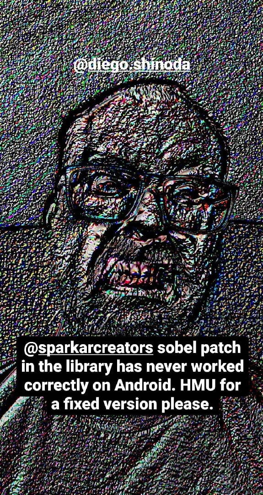

## Sobel patch fix

The sobel patch in the Spark asset library is great, but it has an awful bug on Android devices. This is a fixed version of the patch! 

To make your life easier, the texture size input has been replaced with an internal `Render Target Size` patch.

